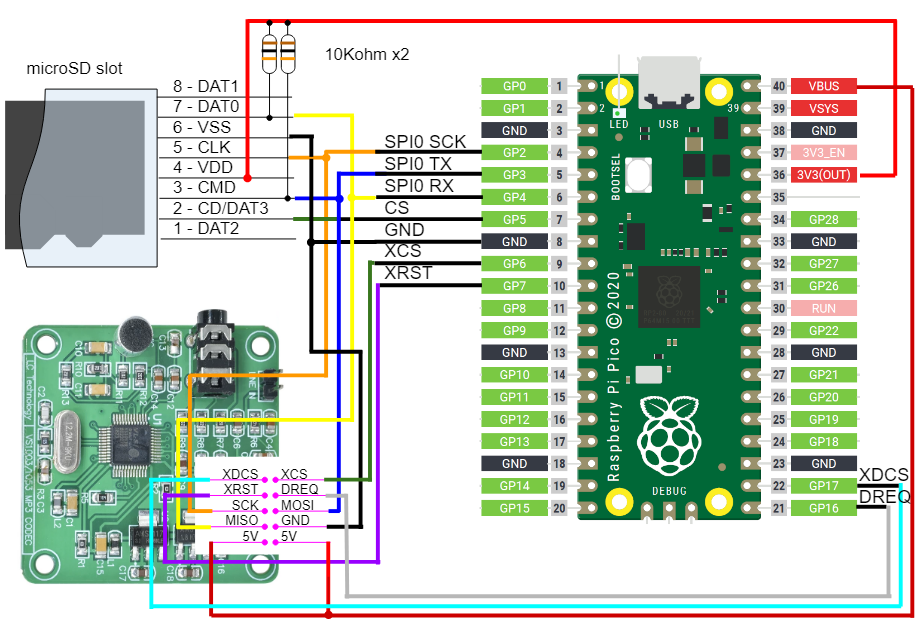

# Raspberry Pi Pico TinyGo VS1053
## Overview
This project is an example of VS1053 on Raspberry Pi Pico by TinyGo.
* confirmed with TinyGo 0.22.0

This project features:
* VS1053 MP3 playback
* read MP3 bitstream by goroutine with Mutex for SPI, which allows to share single SPI for both VS1053 and SD card
* Filesystem by FatFs R0.13c ([http://elm-chan.org/fsw/ff/00index_e.html](http://elm-chan.org/fsw/ff/00index_e.html))
  (SD card supports SD, SDHC, SDXC cards and FAT16, FAT32, exFAT formats)
* machine optimization by CGO to improve SPI access performance

## Supported Board
* Raspberry Pi Pico
* VS1053 Board (confirmed with LC Technology board)

## Ciruit Diagram


## Pin Assignment
### Serial (CP2102 module)
| Pico Pin # | Pin Name | Function | CP2102 module |
----|----|----|----
|  1 | GP0 | UART0_TX | RXD |
|  2 | GP1 | UART0_RX | TXD |
|  3 | GND | GND | GND |

### VS1053 board
| Pico Pin # | Pin Name | Function | VS1053 board |
----|----|----|----
| 14 | GP10 | SPI1_SCK | SCK |
| 15 | GP11 | SPI1_TX | MOSI |
| 16 | GP12 | SPI1_RX | MISO |
| 17 | GP13 | SPI1_CSn | XCS |
| 19 | GP14 | GPIO Output | XRST |
| 20 | GP15 | GPIO Output | XDCS |
| 21 | GP16 | GPIO Input | DREQ |
| 23 | GND | GND | DGND |
| 40 | VBUS | 5V | 5V |

### microSD card
| Pico Pin # | Pin Name | Function | microSD connector | microSD SPI board |
----|----|----|----|----
| 12 | GP9 | SPI1_CSn | CD/DAT3 (2) | CS |
| 13 | GND | GND | VSS (6) | GND |
| 14 | GP10 | SPI1_SCK | CLK (5) | CLK |
| 15 | GP11 | SPI1_TX | CMD (3) | MOSI |
| 16 | GP12 | SPI1_RX | DAT0 (7) | MISO |
| 36 | 3V3(OUT) | 3.3V | VDD (4) | 3V3 |

#### Caution
* SPI1_TX and SPI1_RX needs to be pull-ed up with 10Kohm.
* Wire length between Pico and SD card is very sensitive. Short wiring as possible is desired, otherwise errors such as Mount error, Preallocation error and Write fail will occur.
* SPI interface can be shared or serarated with VS1053

## How to build
* Build is confirmed only in TinyGo Docker environment with Windows WSL2 integration
* Before starting docker, clone repository to your local enviroment (by GitBash etc.)
```
> cd /d/somewhere/share
> git clone -b main https://github.com/elehobica/pico_tinygo_vs1053.git
```

* Docker
```
> wsl
(in WSL2 shell)
$ docker pull docker pull tinygo/tinygo
$ docker images
$ docker run -it -v /mnt/d/somewhere/share:/share tinygo/tinygo:latest /bin/bash
(in docker container)
# cd /share

(copy repository for docker native directory for best performance of WSL2, otherwise stay /share)
(# cp -r /share/pico_tinygo_vs1053 ~/ && cd ~ )

# cd pico_tinygo_vs1053
```

* Go Module Configuration
```
# go mod init github.com/elehobica/pico_tinygo_vs1053
# go mod tidy
```

* TinyGo Build
```
# tinygo build -target=pico -o pico_tinygo_vs1053.uf2

(copy UF2 back to Windows local if working on docker native directory)
(# cp pico_tinygo_vs1053.uf2 /share/pico_tinygo_vs1053/ )
```

* Put UF2 

Then, go back to Windows environment and put "pico_tinygo_vs1053.uf2" on RPI-RP2 drive

## Playback function
* put "track001.mp3: abd "track002.mp3" on root directory of SD card
* no operability while playing "track001.mp3" because of blocking playback
* while playing "track002.mp3", following commands through Serial are available

| Key | Function |
----|----
| p | Pause / Play |
| +, = | Volume Up |
| - | Volume Down |

If SD card read error occurs (panic: runtime error, etc), try [pico_tinygo_fatfs_test](https://github.com/elehobica/pico_tinygo_fatfs_test) at first.